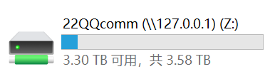
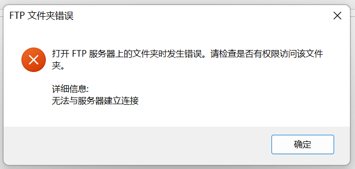

# 关于SMB协议在交大校园网内无法使用的解决方案

如果你还没有接入服务器，请访问[这里](./FileServer)。

由于交大校园网的防火墙禁止了对445端口的访问，导致原先基于SMB的文件服务器(Windows文件管理器```\\homeserver040322.ddns.net```)无法在连接校园网时使用，使用移动数据和热点则不受影响。

原本的HTTP下载服务器([http://homeserver040322.ddns.net:18080](http://homeserver040322.ddns.net:18080)不受防火墙影响。

## 解决方法一(recommended)

我在路由器上新建了一条NAT规则，将路由器的44500端口映射到服务器的445端口上。

经```nmap```端口扫描，44500端口未被防火墙屏蔽。

由于我懒得写教程，请参考如下链接：

- 主教程：[windows 修改smb服务端口(无法通过其他端口连接smb服务)](https://www.xiaoc.cn/article/2021_12_31/407.html)

- 如遇问题，请参考：[知乎 - Windows 10 下如何修改 smb 连接的默认端口(445)？](https://www.zhihu.com/question/59814912)


其中，服务器地址为```homeserver040322.ddns.net```，服务器端口为```44500```.

**提示：**

1. 运行```cmd```方法：在搜索栏搜索```cmd```，视情况点击```打开```或是```以管理员身份运行```；
2. 若```service.msc```打不开，请直接在搜索栏搜索```服务```并打开；
3. ```connectaddress=```后**可以用域名**。
4. 若重启后失效(请先重启一遍确认失效)，请进入```服务```，找到```IP Helper```，改成```自动(延迟启动)```，然后点一下```停止```，再点一下```启动```.

完成后，你应看到如下图标：



## 解决方法二

因为SMB修改服务端口的操作比较复杂，我于是又开了一个FTP服务。

使用方法：

Windows文件管理器 -> 上方菜单栏 -> 点```···```(*仅有Windows 11需要*) -> 点映射网络驱动器 -> 点下方一行蓝字<font color=blue><u>连接到可用于存储文档和图片的网站</u></font> -> 下一页 x2 -> 输入```ftp://homeserver040322.ddns.net``` -> 取消勾选```匿名登录```，用户名填写```qq``` -> 给它起一个名字 -> 完成

如果它索要密码，输入```22comm```.

完成后，你应看到如下图标：


**然而，FTP服务在不同网络条件下稳定性参差不齐。**

在```SJTU```下，FTP服务正常工作。<sup>[Citation needed]</sup>

然而在寝室网络下，FTP稳定性堪忧。目前的稳定性大致为两次请求有一次成功。

经过服务端和客户端用[Wireshark](https://baike.baidu.com/item/Wireshark/10876564?fr=aladdin)抓包可知，在服务端和客户端之间，有一个设备阻断了服务端发送的TCP数据包并向客户端发送```[RST,ACK]```TCP数据包强制阻断连接。

用人话来讲，*校园网防火墙*在服务开始后一段时间阻断了FTP服务的TCP通讯。

在使用时，会看到以下错误：



通过频繁刷新，重新访问，可以获得有限的访问。
