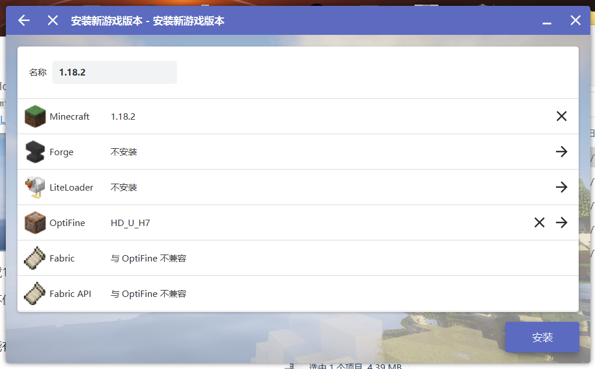
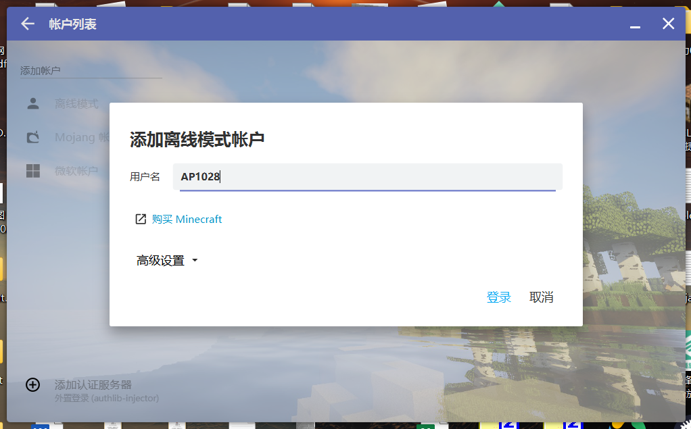

# Minecraft服务器

我通过一些方法在家里搭建了一个Minecraft服务器，并转换导入了JZMF的地图。

目前，有4个服务器进程，2个JAVA版，2个基岩版。

如何让JAVA版建造和基岩版建造同步，目前还是个待解决的问题。

如果你们希望在MC建完JZMF，可以加入对应的服务器开展建设。若建造完成，我可以尝试安排更多有趣的事(比如MC云端返校)

如果遇上任何问题(比如<u>连接不上</u>，<u>客户端不会安装</u>，或是<u>有人在服务器里捣乱</u>)，或是有想法、建议和要求(<u>开展跨平台建造计划</u>，<u>切换版本</u>，<u>模组</u>，<u>临时调整服务器进程容量</u>，或是<u>找我要光影包</u>)，可以直接微信里ping我，或是把问题发往我的邮箱(tian_yi_xia@qq.com)，我乐意帮助解决一切问题。

## 1. 服务器信息

所有4个服务器进程都运行在分配了 32G RAM 和12核24线程CPU的 Ubuntu 22.04 LTS Linux 虚拟机中(物理机运行  CentOS 7 Linux, 64G RAM, 24核48线程 Intel Xeon E3)。每个JAVA服务器进程分配了8G内存，每个基岩版服务器进程分配了最大16线程。

服务器会尝试24/7工作，可能因维护短时中断服务。

若使用量激增，8G内存和CPU线程可能不够。若遇到这种情况，请提前告知我修改虚拟机和服务器资源配置。

注意：<u>所有服务器都只支持国际版或第三方客户端版本</u>，**不支持网易版**。你可以尝试安装**第三方客户端**([见下文](#国际版客户端安装教程))

### 1. JAVA版(v1.18.2)

1. **公共生存服务器**(我懒得做服务器管理，进来随便玩玩，没有规则)

   地址：**<u>homeserver040322.ddns.net</u>**
   
   游戏设置：困难模式，死亡不掉落
   
2. **JZMF建设服务器**(一座JZMF坐落于超平坦大陆上，可以用作建造计划)

   地址：**<u>homeserver040322.ddns.net:25566</u>**
   
   
   
   
   
   
   
   
   
   

### 2. 基岩版(v1.19.2)

1. **基岩版公共生存服务器**(同JAVA版的公共生存服务器)

   地址：**<u>homeserver040322.ddns.net</u>**

   端口号：**<u>19132</u>**
   
   游戏设置：困难模式，死亡不掉落
   
2. **基岩版JZMF服务器**(同JAVA版的JZMF建设服务器，可以用作建造计划)

   地址：**<u>homeserver040322.ddns.net</u>**

   端口号：**<u>19134</u>**

## 2. <span id="国际版客户端安装教程">国际版客户端安装教程</span>

如果你不了解MC或不会安装国际版第三方客户端，可以参照以下教程。

我盲猜网易根本没有更新到 Java 1.18 和 Bedrock 1.19 =)

### 1. JAVA版(Windows/Mac/Linux)

#### 1. 客户端部署

对于Windows/Mac/Linux，请直接官网下载

[官网下载页面](https://hmcl.huangyuhui.net/download/)

[本站github.io下载](./HMCL-3.5.3.exe)

当你下载完后，把HMCL放入你想要存储它的文件夹，比如```D:\HMCL```

运行HMCL-X.X.X.exe，并完成游戏下载安装。(见下文)

所有的游戏文件都会放置在exe同目录下，比如在刚才那种情况，HMCL会生成```D:\HMCL\.minecraft```文件夹


对于安卓，有一个叫做HMCL-PE的东西，可以部分实现HMCL的功能，但仍然在开发早期阶段，有较大局限。

[GitHub下载页面](https://github.com/Tungstend/HMCL-PE/releases/tag/22.6.18-update)


#### 2. 使用HMCL下载并运行 Minecraft v1.18.2

打开HMCL


点下载，然后下载1.18.2

如果你电脑性能不佳，可以考虑点入Optifine装最新版本的Optifine提高帧数

如果你对电脑性能有自信，想要装光影，也需要安装Optifine

其余均不安装



然后点安装，等待下载完成

待安装完后，回到主页，点左上角"没有游戏账户"，选离线模式，然后输入任意用户名。

这个用户名会显示在游戏中。



登录后点左下角启动游戏，你就完成了。

待启动完毕，点多人游戏，然后点直接连接或者添加服务器，输入地址后连接。


### 2. 基岩版(Android)

直接点击[链接](http://dl7.692657.com/down/minecraft_v1.19.2.02_mod.apk)下载

安装完后，点击上方server，然后点击最下方按钮```Add Server```

输入相应的地址和端口号


然后当你准备加入服务器前，它会强迫你登录微软账号

请遵守它的指示登录/注册账号，然后加入服务器


